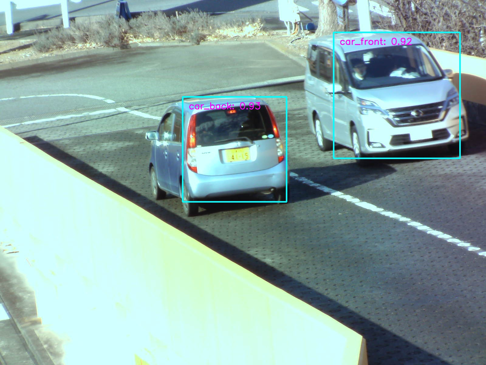

# Single Shot MultiBox Detector Implementation in Pytorch


## Requires (when test)
- Python == 3.7.9
- Pytorch == 1.7.0
- torchvison == 0.8.1
- Opencv-Python == 3.4.2

## Detected Demo
### Video
リアルタイムで動画 or カメラ入力を検出・表示する。  

To Run: `run_ssd_live_demo.py <net type> <model path> <label path> [video file]`
- net type: `vgg16-ssd`, `mb1-ssd`, `mb1-ssd-lite`, `mb2-ssd-lite` or `sq-ssd-lite`.
  - `vgg16-ssd`     : VGG16 based SSD.
  - `mb1-ssd`       : MobileNet based SSD.
  - `mb1-ssd-lite`  : More lite MobileNet used. 
  - `mb2-ssd-lite`  : MobileNetV2 lite model based SSD. 
  - `sq-ssd-lite`   : Use SqueezeNet model.
- model path: `path/to/model.pth`.　
  - PASCAL VOC pretrained model is [here.](https://github.com/mashyko/pytorch-ssd#pretrained-models)
  - 卒研では車のモデル作った。詳細欲しければ連絡いただければと。
- lebel path: `path/to/label.txt`.
  - If you use pretrained model, use `models/voc-model-labels.txt`.
  - If it is your original model, make sure it is compatible with it.
- video file (optional): `paht/to/video`. If you want to use cam, without this param. 

### Picture
検出したい画像のパスを入れるか、sample_dataに入ってる画像を検出し、
結果を`sample_data/detect_result/*_res.jpg`に出力する。

To Run: `run_ssd_example.py <net type> <model path> <label path> [image path]`  
- net type, model path, label path: Plz show above explain.
- video file (optional): `paht/to/image`. If without this param, use `sample_data/*.jpg`.

#### <専攻科研究で作った車の前後検出デモ>
|origin image|detected image|
|---|---|
|||

## Train Model
ベースネットを選択して学習、モデルと検証時の誤差を保存する。

To Run: `train_ssd.py <many options>`
- `--dataset_type default=voc`
  - supported `voc` or `open_images`
- `--datasets path/to/dataset1 path/to/dataset2 ...`
  - **Required**
  - You can use **same type** multiple dataset.
  - VOC dataset format is [below](#example-voc-dataset-format).
- `--validation_dataset path/to/val_dataset`
  - **Required**
  - VOC dataset is managed by train_list.txt and val_list.txt. Val_data path should be the same as train_data.
- `--net default=vgg16-ssd`
  - vgg16, MobileNet, MobileNetlite or MobileNetV2Lite
- `--pretrained_ssd path/to/pretrained_ssd_model`
  - For transfer learning or model's param initialize
- `--checkpoint_folder path/to/save_dir/default=models/`
- `--lr default=1e-3`
- `--num_epochs default=120`
- `--scheduler default=multi-step`
  - learning rate's scheduler; "multi-step" or "cosine"
- `--num_workers <int>`
  - torch "Dataloader" param; num of subprocess for data loading.
  - **windowsは、0じゃないとエラー吐くかも**

>more info: [this repository](https://github.com/mashyko/pytorch-ssd)


### example: VOC dataset format
#### Basic file path
```
dataset --- Annotations
         |      ├- XXX_1.xml
         |      :
         |
         ├- JPEGImages
         |      ├- XXX_1.jpg
         |      :
         |
         ├- trainval_file_list.txt
         ├- test_file_list.txt
         └- labels.txt
```

#### Annotation.xml architecture
```
<annotation>
    <object>
        <name>label name</name>
        <difficult>0</difficult>
        <bndbox>
            <xmin>123</xmin>
            <ymin>456</ymin>
            <xmax>789</xmax>
            <ymax>987</ymax>
        </bndbox>
    </object>
    <object>
        :
        
    </object>
      :
      
</annotation>
```
> This is minimum example. In other cases, some header may be added.

#### trainval/test_file_list.txt format
```
XXX_1
XXX_2
XXX_ABC
.
.
.
```
> File name only. File extensions are not required.

#### labels.txt format
```
BACKGROUND  # Required
aeroplane
bicycle
.
.
.
```
> The "BACKGROUND" label is mandatory.


# Based on, LICENCE
>Copyright (c) 2019 mashyko:　https://github.com/mashyko/pytorch-ssd  
>MIT LICENCE: `./LICENCE`
